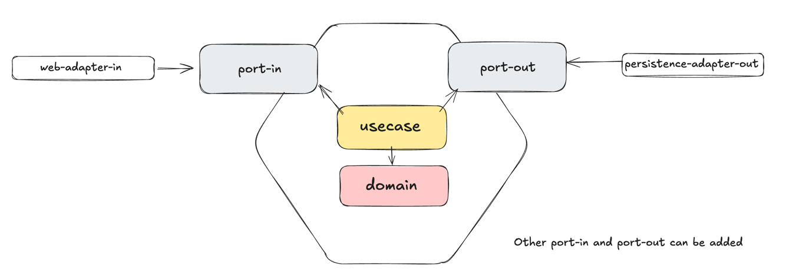
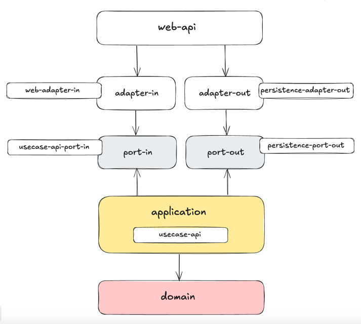

# Backend Boilerplate

### Tech Stack

### Architecture
Used Hexagonal Architecture to loosen external dependencies and keep the domain clean.

### Module Dependency
Used Multi Module to avoid incorrect dependencies.

### DB Replication
reader writer replication

### API response format
The API response is defined based on JSON API(https://jsonapi.org/)
~~~
# single response sample
{
    "data": {
        "contentId": 1,
        "likedCount": 971
    }
}
~~~
~~~
# paged reponse sample
{
    "data": {
        "items": [],
        "prevLink": null,
        "nextLint": null,
    }
}
~~~

### logger policy
Used KotlinLogging to express logs concisely in a Spring-Kotlin stack.
Declared logger  outside the class to prevent unnecessary object creation when instantiating the class.
Optimized string operations using the lambda block format in logger.info {}.
~~~
private val logger = KotlinLogging.logger {}

class A {
    logger.info { "[Sample Log]" }
}
~~~

### exception convention

### Code format

install ktlint plugin in IntellJ and set Distract free & on save option

### Todo List
- [x] gradle setting
- [x] architecture design
- [x] package naming
- [x] docker setting for init
- [x] jpa / db setting
- [x] mvc run check
- [x] lint setting
- [x] define controller response
- [ ] logger setting
- [ ] log masking
- [ ] exception setting
- [ ] ci/cd process setting
- [ ] package versioning
